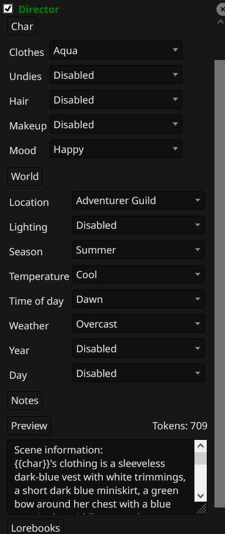

# About

Director is an addon for Silly Tavern that aims to give you quicker control over custom things like clothing, locations, world info such as time of day and weather. Your chosen settings are injected into the prompt each time you remind the AI of those details. By injecting constant reminders of what a character is wearing or where they it helps the AI remain consistent.

# Install

Paste the address into ST's extension menu. After installing, the addon will show up in the extensions dropdown. You can use it within the extensions menu or click the pop-out button.

# Usage

Create lorebooks for settings you intend use such as "clothing" or "locations". Create entries within the lorebook to describe your clothing or setting. After creating a lorebook, at the bottom of the Director addon is a 'Lorebooks' section where you associate your new lorebook with a setting. Once set, the popups for user/char will populate accordingly. Then you can select an option and it will be injected into the AI prompt next time.

# World

There is a default 'director_world' lorebook included with the install (should be located at st\public\scripts\extensions\third-party\Director). Import it to your ST. World settings read a bit different and offer custom creation of settings. Example: creating a setting called 'year', with an entry that says '2005, 2006, 2006' will fill the dropdowns with those years, note they are seperated by a comma. All of the settings under world work this way and get injected like: 'The year is 2005' where 'year' is the lorebook entry and '2005' is one of the contents.

'Mood' is the only exception to the world book in that options for it are held in the world lorebook, but appear under both user/char sections.

# Chat

I recommend leaving the injection point as depth 3 in chat, so it is one below author notes (4 by default).
